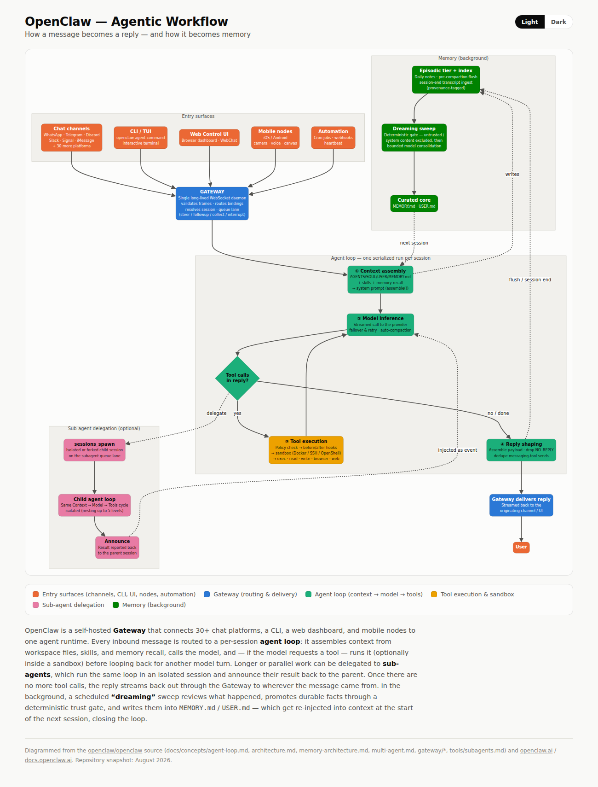

# OpenClaw Mini

A stripped-down, runnable reimplementation of [OpenClaw](https://github.com/openclaw/openclaw)'s
agentic workflow — the same shape (Gateway → agent loop → tools → sub-agents
→ memory), the same file and class names where it's reasonable to reuse
them, but small enough to read in one sitting and run on your own machine
with one small open-weights model instead of a hosted API.

This exists to make the architecture concrete. Every engineering and
optimization concern that makes the real system production-grade —
sandboxing, queueing and concurrency, streaming, plugin hooks, token
budgeting, provenance-gated memory promotion — has been deliberately left
out. What's left is the control flow: how a message becomes a reply, and how
a reply becomes memory. See [What's real vs. simplified](#whats-real-vs-simplified)
for the full list of what got cut and why.

## Quickstart

```bash
pip install -r requirements.txt
python main.py
```

The first run downloads the model from Hugging Face (a few hundred MB to a
few GB depending on which one you pick — see [Customizing](#customizing)),
so it needs a normal internet connection and a minute or two. After that
it's cached locally and starts instantly.

Don't want to wait on a download, or just want to see the wiring work
first? Run the no-network version:

```bash
python sanity_check.py
```

This drives the exact same code with a scripted fake model
(`openclaw_mini/mock_model.py`) instead of a real one — same Gateway, same
agent loop, same tool-call loop, same sub-agent recursion, same memory
write and `dream()` call — done in a couple of seconds, no GPU required.

Already have [Ollama](https://ollama.com) running locally instead? Skip the
Hugging Face download entirely:

```bash
ollama pull qwen3:4b
python main_ollama.py
```

Same diagram, same code — only the model backend
(`openclaw_mini/ollama_model.py`) differs. It talks to `ollama serve` over
plain HTTP using nothing but the standard library, so this path needs no
`pip install` at all.

Want to see the loop work an actual task instead of the scripted demo
turns above? `run_task.py` sends one open-ended prompt through the same
Gateway/AgentLoop/tools/memory code, with a much higher tool-call ceiling
than the demos use (see [What's real vs. simplified](#whats-real-vs-simplified)):

```bash
python run_task.py                       # runs a built-in example task
python run_task.py "your own task here"
```

It prints the same stage-by-stage trace, then lists whatever files the
model saved to `workspace/` with `write_file`.

## The diagram



Open `docs/agentic-workflow.html` in a browser for the interactive version
(light/dark toggle). This code follows that diagram box for box; the
circled numbers on the diagram (①②③④) show up as `stage()` calls from
`openclaw_mini/trace.py`, so running `python main.py` prints each stage as
it fires — along with everything that happened inside it (see
[Tracing](#tracing) below).

## How it works

**Entry surfaces.** Real OpenClaw has 30+ chat-channel adapters, a CLI, a
web dashboard, and mobile nodes all feeding into the Gateway. This demo has
one entry point instead: calling `gateway.handle_message(session_key, text)`
directly, the way `main.py` does. Whatever channel a message would have
come from in the real system, it all funnels down to that one call.

**Gateway** (`openclaw_mini/gateway.py`, class `Gateway`). Owns a dict of
`Session`s keyed by `session_key`, and hands each incoming message to a
fresh `AgentLoop` for that session. Real OpenClaw's Gateway is a single
WebSocket daemon that also does channel routing, agent bindings, and
per-session/global queue lanes; here it's just a router.

**① Context assembly** (`openclaw_mini/context.py`, class `ContextEngine`,
method `.assemble()` — same name as the real interface in
`docs/concepts/context-engine.md`). Reads the workspace's bootstrap files —
`AGENTS.md`, `SOUL.md`, `USER.md`, `MEMORY.md` — builds a system prompt out
of them plus the tool list, and appends the session's conversation history.
That's the whole context window; no token budget, no compaction, no
pluggable engines.

**② Model inference** (`openclaw_mini/model.py`, class `ModelProvider`,
method `.infer()`). Sends the assembled messages to one small open-weights
model running locally via Hugging Face `transformers`, greedily and
synchronously, and gets back plain text. `openclaw_mini/ollama_model.py`'s
`OllamaModelProvider` is a second backend with the exact same `.infer()`
shape, for talking to a local `ollama serve` over HTTP instead — see
`main_ollama.py`. Real OpenClaw's provider layer supports both kinds
(hosted APIs and local servers like Ollama) side by side
(`src/llm/providers/`); this demo just picks one per run instead of
failing over between them. Each `ModelTurn` a provider returns can also
carry token counts and a reasoning/thinking trace when the model produced
one (Qwen3 and other hybrid-thinking models) — MockModelProvider is the
one provider that never sets these, since it isn't a real model. See
[Tracing](#tracing).

**Tool calls in reply?** The decision diamond. `.infer()` always returns
plain text, so `openclaw_mini/tools.py`'s `parse_tool_calls()` checks
whether that text is a JSON tool call — one object, or a JSON array for
more than one at once — the format the system prompt asks for, or an
ordinary reply.

**③ Tool execution** (`openclaw_mini/tools.py`, function `run_tool()`,
registry `TOOLS`). A single model turn can request one tool call or
several at once — `parse_tool_calls()` accepts either a single
`{"tool": ..., "arguments": {...}}` object or a JSON array of them,
mirroring how real OpenClaw's runner collects however many `tool_use`
blocks (`clientToolCalls`/`pendingToolCalls`) came back in one turn,
including OpenAI's `parallel_tool_calls` (on by default there). Each call
in the batch runs its matching Python function directly — no policy check,
no sandbox, no before/after hooks — in the order the model listed them,
and all their results feed back into the conversation as one turn. The
loop then goes straight back to ① Context assembly for another model
turn, exactly like the arrow on the diagram. `MAX_TOOL_HOPS` in
`agent_loop.py` bounds model round-trips, not individual tool calls —
one round-trip can now carry several — and just stops it from looping
forever; it isn't a tuning knob.

**Sub-agent delegation** (the `sessions_spawn` tool, same name as the real
one, in `tools.py`). Implemented as *just another tool* — which is also how
the real system does it. Calling it constructs a brand new `Session`,
spawns a fresh `AgentLoop` for it, and runs that child loop to completion
right now, synchronously, capped at one level deep. Its final reply becomes
the tool's result and flows back into the parent's next turn. Real
OpenClaw's version is non-blocking and the child *announces* its result
back later, whenever it finishes, which is why sub-agents can run in
parallel there — this demo trades that for something easier to trace
through on a first read.

**④ Reply shaping.** Once a model turn *isn't* a tool call, `AgentLoop.run()`
treats it as the final reply for that turn, drops it if it's the exact
silent token `NO_REPLY` (same convention the real system uses), and writes
an episodic note before returning.

**Memory writes** (`openclaw_mini/workspace.py`, method
`write_episodic_note()`). Every finished turn appends a couple of lines to
today's dated file under `workspace/memory/` — never straight to
`MEMORY.md`. That distinction matters: in both the real system and this
one, nothing the model says during a live turn edits long-term memory
directly.

**Dreaming** (`openclaw_mini/memory.py`, function `dream()`). Not triggered
by any message — it's the background box on the diagram. Call it whenever a
"session" ends (`main.py` calls it once, by hand, after a few turns) and it
reads every daily note, asks the model to fold anything durable into the
existing `MEMORY.md`, and overwrites the file. The next `assemble()` call
picks up the new content automatically — that's the feedback arrow closing
the loop back into ① Context assembly at the start of the next session.

## Tracing

Every stage narrates what it's doing as it runs
(`openclaw_mini/trace.py`, functions `stage()`/`trace()`/`trace_block()`/
`trace_tokens()`) — which box is active, the model's input/output token
counts, its full reasoning/thinking trace when it produced one, and every
tool call's arguments and result, for example:

```
    · ② Model inference
      ↳ tokens: input=812 output=341
      ↳ thinking:
        | Okay, let's see. The user wants...
    · ③ Tool execution — calculator
      ↳ arguments:
        | {
        |   "expression": "482 * 17 - 96"
        | }
      ↳ result:
        | 8098
```

This is unfiltered on purpose, so a run is fully traceable step by step —
expect it to be verbose, especially with thinking models. `memory.dream()`
narrates the same way, since it's a model call too, just not one triggered
by an incoming message. `openclaw_mini.mock_model.MockModelProvider` never
sets token counts or a thinking trace on the `ModelTurn`s it returns, so
`sanity_check.py`'s output only ever shows the stage markers, not the
`↳` detail lines.

## What's real vs. simplified

| Diagram stage | Real OpenClaw | This repo | Left out here |
|---|---|---|---|
| Entry surfaces | 30+ channel adapters, CLI, web UI, mobile nodes | one direct method call | every channel adapter, the WebSocket protocol |
| Gateway | WebSocket daemon, agent bindings, multi-agent routing | `Gateway`, a dict of sessions | queue lanes (steer/followup/collect/interrupt), concurrency caps, bindings |
| Context assembly | pluggable engines, token budgets, compaction | `ContextEngine.assemble()` | compaction, token budgeting, pluggable engines, skills |
| Model inference | many hosted providers, streaming, failover/retry | `ModelProvider.infer()`, one local model | token streaming, provider failover, retries |
| Tool execution | allow/deny policy, before/after hooks, Docker/SSH/OpenShell sandbox | a direct Python function call | tool policy, hooks, sandboxing |
| Sub-agents | non-blocking, push-based "announce," up to 5 levels deep | one blocking call, capped at 1 level | async delivery/retry machinery, deeper nesting |
| Memory / dreaming | provenance tags, deterministic trust gates, recall ranking, scheduling | one on-demand `dream()` call | trust gating, scheduled runs, recall ranking |

## Project layout

```
openclaw-mini/
├── main.py                    run everything with a real model (Hugging Face)
├── main_ollama.py              run everything against a local `ollama serve`
├── run_task.py                  give the loop one open-ended task (Ollama)
├── sanity_check.py            run everything with a scripted fake model
├── requirements.txt
├── workspace/                 the agent's workspace — edit these freely
│   ├── AGENTS.md               operating instructions
│   ├── SOUL.md                 persona / tone
│   ├── USER.md                 who the user is
│   ├── MEMORY.md               curated long-term memory (written by dream())
│   └── memory/                 episodic daily notes (created at runtime)
├── openclaw_mini/
│   ├── gateway.py               Gateway
│   ├── session.py                Session
│   ├── context.py                ContextEngine.assemble()      — ① 
│   ├── model.py                  ModelProvider.infer()          — ②
│   ├── ollama_model.py           OllamaModelProvider.infer()    — ② (Ollama backend)
│   ├── mock_model.py             MockModelProvider (for sanity_check.py)
│   ├── tools.py                  tool registry, sessions_spawn — ③
│   ├── agent_loop.py             AgentLoop.run()                — ④ + the loop itself
│   ├── memory.py                 dream()
│   └── trace.py                  stage()/trace() console narration
└── docs/
    ├── agentic-workflow.png       the diagram, static
    └── agentic-workflow.html      the diagram, interactive
```

## Customizing

**Swap the model.** Change `DEFAULT_MODEL` in `openclaw_mini/model.py`.
`Qwen/Qwen2.5-0.5B-Instruct` is smaller and faster if you want a lighter
download; `Qwen/Qwen2.5-3B-Instruct` or bigger will follow the "reply with
JSON to call a tool" instruction more reliably than the 1.5B default. Any
instruction-tuned causal LM that `transformers` can load will work — the
rest of the code doesn't know or care which one it's talking to.

Same idea on the Ollama backend: change `DEFAULT_OLLAMA_MODEL` in
`openclaw_mini/ollama_model.py`, or just pass any tag you've already
pulled straight in — `OllamaModelProvider(model_name="llama3.2:3b")`.

**Add a tool.** Write a function `def my_tool(arguments: dict, ctx: ToolContext) -> str`
in `tools.py`, add it to the `TOOLS` dict and a line to `TOOL_DESCRIPTIONS`.
Nothing else needs to change.

**Change the persona or instructions.** Just edit the files under
`workspace/` — they're plain Markdown, read fresh on every turn.

## Source

Built from a read-through of the [openclaw/openclaw](https://github.com/openclaw/openclaw)
source, especially `docs/concepts/agent-loop.md`, `docs/concepts/architecture.md`,
`docs/concepts/context-engine.md`, `docs/tools/subagents.md`, and
`docs/concepts/memory-architecture.md`. Not affiliated with the OpenClaw
project — this is a learning aid, not a compatible implementation.
